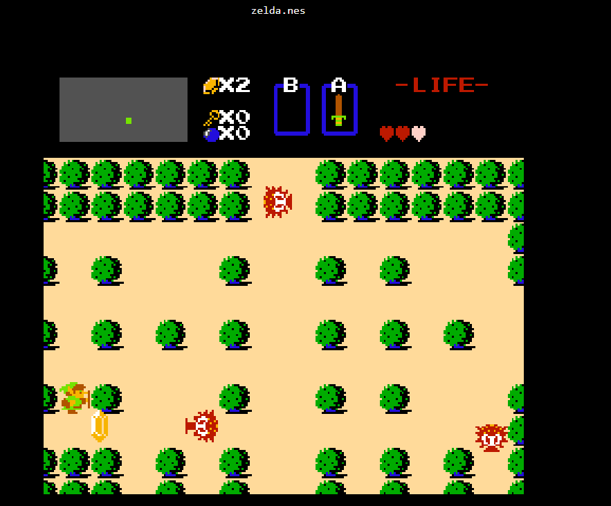

# Zaujímavé JavaScript aplikácie

<ul>
<li> carbon-app </li>
<li> MIDIano </li>
<li> jsnes </li>
</ul>

## carbon-app
https://github.com/carbon-app/carbon 
Appka na vytváranie krajších screenshotov kódu.
#### Ukážka aplikácie
https://carbon.now.sh/ 
Ukážka screenshotov kódu, na ktoré boli aplikované voliteľné presety.

#### Charakteristika
Aplikácia sa dá spustiť buď ako desktop aplikácia (offline mode), alebo v browseri, kde je možné drag and dropnúť svoj kód. Dá sa pridať aj ako plugin do editorov ako napríklad Atom, Vim, Sublime Text 3, atď. Cieľom tejto aplikácie je zlepšiť vzhľad screenshotov vášho kódu editovaním nastavení ako farba pozadia, padding... Nakoniec je možné screenshot exportovať (.png, .svg, URL), alebo priamo tweetnuť.

## MIDIano
https://github.com/Bewelge/MIDIano 
Virtuálne klávesy, ktoré hrajú MIDI súbory.

#### Ukážka aplikácie
https://bewelge.github.io/MIDIano/

#### Charakteristika
Jedná sa o browser aplikáciu. Na parsovanie a prehrávanie zvuku používa Midi-js, grafická stránka je urobená cez HTML canvas. Aplikácia sa dá využiť na učenie sa hrať na klavír, v prípade že máte MIDI súbor skladby, ktorú sa chcete učiť. Virtuálne klávesy taktiež farebne rozlišujú medzi pravou a ľavou rukou (ľavá - modrá, pravá - červená).

## jsnes
https://github.com/bfirsh/jsnes 
Emulátor NES hier.

#### Ukážka aplikácie
https://jsnes.org/

#### Charakteristika
Jsnes je emulátorom hier NES. Jedná sa o browser aplikáciu. Na server sa využíva node.js, user interface v browseri je napísaný v Reacte. Aplikácia pracuje s ROM súbormi, je možné na stránku embednúť svoj vlastný ROM file cez drag and drop do menu(prípona súborov .nes). Vhodné pre homebrew ROM developerov.
