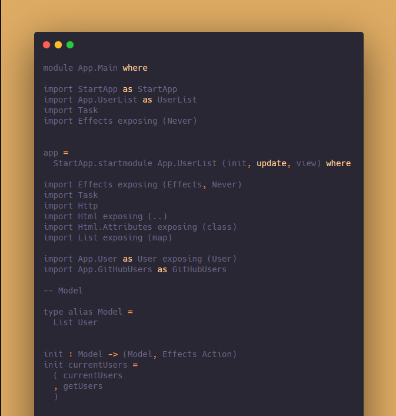
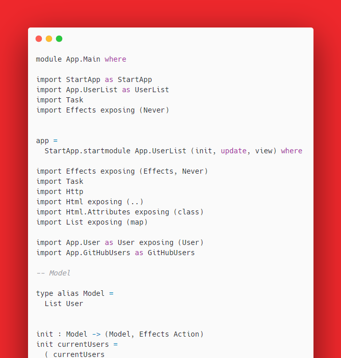

# Zaujímavé JavaScript aplikácie

<ul>
<li> carbon-app </li>
<li> MIDIano </li>
<li> tui-calendar </li>
</ul>

## carbon-app
https://github.com/carbon-app/carbon<br>
Appka na vytváranie krajších screenshotov kódu.
#### Ukážka aplikácie
https://carbon.now.sh/<br>
Ukážka screenshotov kódu, na ktoré boli aplikované voliteľné presety.


#### Charakteristika
Carbon je React app, ktorá sa dá spustiť buď ako desktop aplikácia (offline mode), alebo v browseri, kde je možné drag and dropnúť svoj kód. Na parsing kódu využívajú prettier. Dá sa pridať aj ako plugin do editorov ako napríklad Atom, Vim, Sublime Text 3, atď. Cieľom tejto aplikácie je zlepšiť vzhľad screenshotov vášho kódu editovaním nastavení ako farba pozadia, padding... Nakoniec je možné screenshot exportovať (.png, .svg, URL), alebo prípadne rovno tweetnuť.

## MIDIano
https://github.com/Bewelge/MIDIano<br>
Virtuálne klávesy, ktoré hrajú MIDI súbory.

#### Ukážka aplikácie
https://bewelge.github.io/MIDIano/

#### Charakteristika
Jedná sa o browser aplikáciu. Na parsovanie a prehrávanie zvuku používa Midi-js, grafická stránka je urobená cez HTML canvas. Aplikácia sa dá využiť na učenie sa hrať na klavír, v prípade že máte MIDI súbor skladby, ktorú sa chcete učiť. Virtuálne klávesy taktiež farebne rozlišujú medzi pravou a ľavou rukou (ľavá - modrá, pravá - červená).

## tui-calendar
https://github.com/nhn/tui.calendar
JavaScript kalendár

#### Ukážka aplikácie
Inštalácia - https://github.com/nhn/tui.calendar/blob/master/docs/getting-started.md<br>
```npm install --save tui-calendar```<br>
ukážka:
https://nhn.github.io/tui.calendar/latest/tutorial-example00-basic

#### Charakteristika
TUI - toast UI calendar je modifikovateľný open source JavaScript kalendár. Používa Google Analytics na zbieranie štatistík (koľko ľudí používa tui na svete) - dá sa vypnúť.
Je možné zmeniť view type kalendára - denný, týždenný, mesačný, ... Je možné vypnúť zobrazovanie víkendov v kalendári. Cieľom je vytvoriť flexibilný kalendár, ktorý splní potreby širšej skupiny ľudí.
